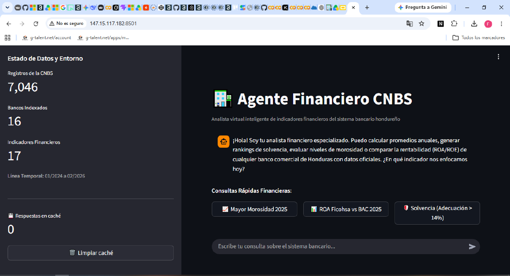
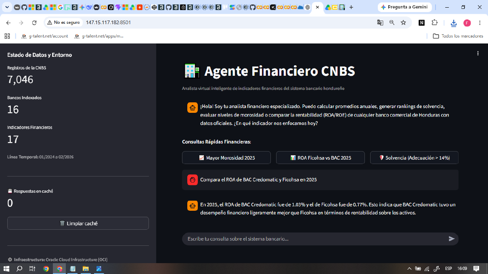

# 🏦 Agente Financiero CNBS (v2.1)

**Agente Financiero CNBS** es un analista virtual especializado en indicadores financieros del sistema bancario hondureño. Construido con Python, utiliza modelos de lenguaje (LLM) y agentes inteligentes para interactuar con datos reales de la Comisión Nacional de Bancos y Seguros (CNBS).

Este proyecto no es solo un chatbot; es un motor analítico que traduce lenguaje natural en operaciones precisas de pandas, garantizando que las respuestas financieras sean **calculadas y no alucinadas**.

---

## 📸 Interfaz en Producción (OCI)

La aplicación está desplegada y operativa en Oracle Cloud Infrastructure:

🔗 **URL pública:** [http://147.15.117.182:8501](http://147.15.117.182:8501)

| Dashboard Principal | Consulta Analítica en Vivo |
|---------------------|----------------------------|
|  |  |
| Interfaz con métricas de estado, historial de chat y caché de respuestas | Ejemplo de consulta sobre morosidad con respuesta contextual y precisión numérica |

---

## 🚀 Detalles Técnicos (Arquitectura v2.1)

Esta versión se ha diseñado bajo principios de **eficiencia de recursos (ROI)** y **precisión analítica**. Los puntos clave de la arquitectura son:

### 1. Motor de Razonamiento (LangChain + Groq)

- En lugar de depender únicamente de la memoria del LLM, utilizamos `create_pandas_dataframe_agent` con `agent_type="tool-calling"`.
- **Ejecución real:** El agente escribe y ejecuta código Python en tiempo real sobre el dataset de **7,046 registros**. Si preguntas por un promedio, el modelo calcula el promedio exacto con pandas, no estima.
- **Determinismo:** `temperature=0` para respuestas consistentes y puramente lógicas.
- **Modelo:** `llama-3.3-70b-versatile` vía **Groq API**.
- **Monitoreo:** `verbose=True` permite visualizar las queries de Pandas generadas en la consola del servidor (útil para depuración en OCI).

### 2. Ingeniería de Prompts (Seguridad y Precisión)

El `CONTEXTO_SISTEMA` incluye directivas estrictas que actúan como **guardrails**:

- **Búsqueda Flexible:** Se obliga al agente a usar `.str.contains(case=False)` con raíces específicas (`ADECUAC`, `ROA`, `ROE`, `MOROSIDAD`) para mitigar errores por tildes o variaciones en los nombres de indicadores.
- **Integridad de Datos:** El agente tiene prohibido recrear el DataFrame, asegurando que siempre opere sobre la fuente única de verdad (`df` global).
- **Limpieza de Ruido:** Se instruye explícitamente la exclusión de registros agregados (`"BANCOS"`, `"HONDURAS"`) para evitar sesgos en rankings individuales.
- **Formato Numérico:** Los valores de la columna `Saldo` ya están en porcentaje directo. El agente está instruido para **no multiplicar por 100**.
- **Contexto de Negocio:** Se incluye una regla específica para **AZTECA**, indicando que es un banco de microfinanzas con perfiles de riesgo más altos (tasas y morosidad mayores), lo que enriquece las respuestas.

### 3. Optimización de Rendimiento

- **Caché de Respuestas:** Implementamos `st.session_state` para almacenar consultas ya resueltas. Esto reduce drásticamente el consumo de tokens en la API de Groq cuando los usuarios repiten preguntas, mejorando la latencia a prácticamente cero.
- **Carga de Datos:** El dataset se carga utilizando `@st.cache_data`, asegurando que el archivo CSV se lea en memoria solo una vez por sesión.
- **Retry Automático:** Manejo de errores con hasta 3 reintentos ante fallos de red o rate limits de Groq.

---

## 📊 Especificaciones del Proyecto

| Característica | Detalle |
|----------------|---------|
| **Framework UI** | Streamlit |
| **Motor de IA** | LangChain Pandas Agent (Tool-calling) |
| **Modelo (LLM)** | Llama 3.3 70B (vía Groq API) |
| **Procesamiento** | Pandas (Vectorizado) |
| **Deploy** | Oracle Cloud Infrastructure (OCI) |
| **Dataset** | 7,046 registros, 16 bancos, 17 indicadores |
| **Período** | Enero 2024 – Febrero 2026 |

---

## 📋 Dataset

- **Fuente:** Comisión Nacional de Bancos y Seguros (CNBS) – Honduras
- **Registros:** 7,046
- **Bancos:** 16 bancos comerciales hondureños
- **Indicadores:** 17 indicadores en 6 categorías

| Categoría | Indicadores incluidos |
|-----------|------------------------|
| **Solvencia** | Índice de adecuación de capital |
| **Calidad de Activos** | Índice de morosidad sobre cartera crediticia total |
| **Liquidez** | Cobertura de mora, calces de moneda |
| **Rentabilidad** | ROA, ROE, tasa activa, spread de intermediación |
| **Gestión** | Gastos administrativos, eficiencia |
| **Cumplimiento** | Indicadores regulatorios CNBS |

---

## 💬 Ejemplos de Consultas y Respuestas Reales

| Pregunta | Respuesta del Agente |
|----------|----------------------|
| ¿Qué banco tiene el mayor índice de morosidad en 2025? | **AZTECA** con **10.40%**. Contexto: banco de microfinanzas con perfiles de riesgo más altos. |
| ¿Cuál fue el ROA de Ficohsa en 2025? | **0.77%** |
| Compara el ROA de BAC Credomatic y Ficohsa en 2025 | **BAC: 1.03%** vs **Ficohsa: 0.77%**. BAC tuvo un desempeño ligeramente mejor en rentabilidad sobre activos. |
| ¿Qué bancos tienen adecuación de capital > 14% en 2025? | **AZTECA** (25.53%), **BANHCAFE** (22.00%), **BANCOCCI** (18.41%), **BANCO POPULAR** (15.60%), **BANRURAL** (14.51%) |

---

## 🛠️ Estructura del Proyecto

```plain
agente-financiero-cnbs/
├── app.py                  # Motor principal: UI + Agente + Lógica (v2.1)
├── requirements.txt        # Dependencias (Streamlit, LangChain, Pandas)
├── .env.example            # Plantilla para variables de entorno
└── data/
    └── indicadores_financieros_CNBS.csv  # Dataset oficial CNBS
```

---

## ⚙️ Configuración e Instalación

### 1. Clonar el repositorio

```bash
git clone https://github.com/tu-usuario/agente-financiero-cnbs.git
cd agente-financiero-cnbs
```

### 2. Variables de entorno

Crea un archivo `.env` basado en `.env.example`:

```bash
cp .env.example .env
```

Contenido del `.env`:

```plain
GROQ_API_KEY=tu_clave_aqui
```

### 3. Instalar dependencias

```bash
pip install -r requirements.txt
```

### 4. Ejecutar localmente

```bash
streamlit run app.py
```

Abrir en el navegador: `http://localhost:8501`

---

🌐 Deploy en OCI

La aplicación está desplegada en una instancia VM Always Free de Oracle Cloud Infrastructure.

```bash
# En la VM de OCI
cd ~/agente-cnbs
pip install -r requirements.txt

# Ejecutar con systemd (recomendado para producción)
sudo systemctl start agente-cnbs
sudo systemctl enable agente-cnbs  # Inicia automáticamente al bootear
```

**URL pública:** `http://147.15.117.182:8501`

> La app se ejecuta como un servicio `systemd` que se reinicia automáticamente si se cae y arranca sola al bootear la instancia.

---

## 👔 Autor

**Fausto Soto Euraque**  
Industrial Engineer | Data & AI Specialist  
Tegucigalpa, Honduras

[LinkedIn](https://www.linkedin.com/in/fsotoeu) | [GitHub](https://github.com/fsotoeu-cyber)

Desarrollado bajo el enfoque de **Euraque Analytics**.

---

## 📄 Licencia

MIT
